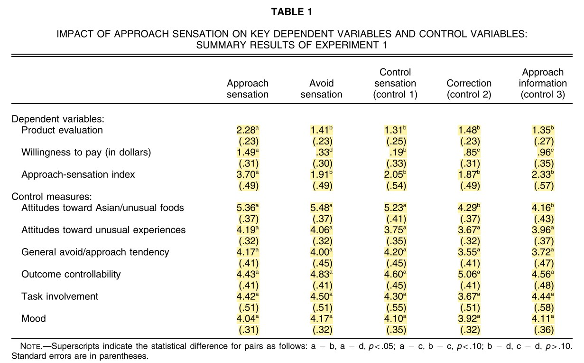
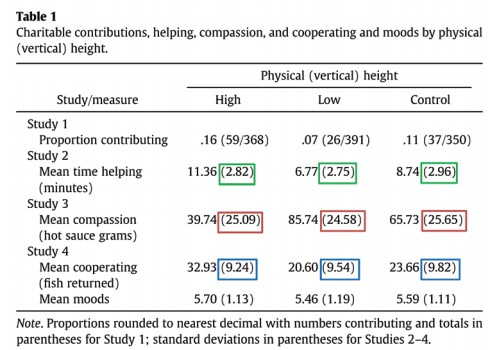

```{r Setup, include=FALSE}
library(dplyr)
library(truncnorm)
library(ggplot2)

# this dataframe is the long version of Table in the paper
tbl1 <- read.csv("table1.csv", stringsAsFactors = FALSE)
```


```{r Functions}
# This function takes in a data frame of characteristics and simulates nreps standard deviations
sd_samp <- function(df, reps) {
  # Number of people in each cell
  nper <- as.numeric(df[1, "n_per"])
  # Minimum score on the scale
  minscore <- as.numeric(df[1, "min_score"])
  # Maximum score on the scale
  maxscore <- as.numeric(df[1, "max_score"])
  # mean observed
  mean <- as.numeric(df[1, "mean"])
  # pooled sd 
  pooledsd <- as.numeric(df[1, "pooled_sd_obs"])
  
  # Simulate SDs
  # NOTE: I'm using a truncated normal distribution because they use a 1-7 scale
  reps <- replicate(reps,
                    sd(rtruncnorm(nper, a = minscore, b = maxscore, mean = mean, 
                                  sd = pooledsd))) 
  reps <- as.data.frame(reps)
  
  names(reps) <- "sd_rep"
  
  reps
}
```


```{r CleanData}
# Add in the number of participants per cell and the standard deviation to table 1
tbl1 <- tbl1 %>%
  mutate(n_per = 11,
         sd = se * sqrt(n_per)) %>%
  arrange(variable) 

# create sd_sd and mean_sd for each variable in the study
tbl1_sum <- tbl1 %>%
  group_by(variable) %>%
  summarise(sd_sd_obs = sd(sd),
            pooled_sd_obs = mean(sd),
            mean_n_obs = mean(n_per),
            se_sds_obs = pooled_sd_obs/(sqrt(2*mean_n_obs)),
            psi_obs = sd_sd_obs / se_sds_obs)

# merge dataframes (need this for the simulation)
tbl1 <- merge(tbl1, tbl1_sum)
```


```{r SimulateSDs}
reps <- 10000

# simulate SDs
tbl1_reps <- tbl1 %>%
  group_by(variable, manip) %>%
  do(sd_samp(df = ., reps = reps))

# add in the replication number
tbl1_reps <- tbl1_reps %>%
  group_by(variable, manip) %>%
  mutate(n_rep = 1:reps) 

# Summarized simulated data
tbl1_reps_sum <- tbl1_reps %>% 
  group_by(variable, n_rep) %>%
  summarise(sd_sd_sim = sd(sd_rep),
            pooled_sd_sim = mean(sd_rep)) %>%
    # get the simulated standard deviations and psi's
  mutate(se_sd_sim = pooled_sd_sim/(sqrt(2 * 11)),
         psi_sim = sd_sd_sim/se_sd_sim)

# merge simulated data with empirical data
tbl1_reps_sum <- tbl1_reps_sum %>% 
  left_join(tbl1_sum)

# compare the number of observed sds that are larger than the simulated sds
tbl1_reps_sum <- tbl1_reps_sum %>%
  mutate(obs_gt_sim = ifelse(sd_sd_obs >= sd_sd_sim, TRUE, FALSE))
```

# Summary 

Labroo and Nielsen (2010) Experiment 1 "demonstrates a positive effect of embodied movement in space toward an otherwise aversive product."

In table 1 of the paper, the standard devations within measures are quite similar to one another. 



Simonsohn (2013) found that similar standard deviations were unlikely to occur do to chance. 


I follow the analysis strategy of Simonsohn below. 

# SD Similarity 

## Within measures

Density plots of the simulated standard deviations for each of the measures reported in Table 1 of Labroo and Nielsen. 
Vertical Lines represent the observed standard deviation of standard deviations. 
Note that the observed standard deviations are all unlikely

```{r Plot, fig.height=12}
# plot the histograms
ggplot(tbl1_reps_sum, aes(x = sd_sd_sim)) +
  geom_density() +
  geom_vline(aes(xintercept = sd_sd_obs)) +
  facet_grid(variable ~ .) +
  theme_classic()
```


## Combined measures

Now combining the standard deviations across measures.  
From Simonsohn 2013 pg. 1878

>  Before aggregating, however, I had to get around the problem that the studies differed in scale (e.g., grams of hot sauce vs.
number of fish) and sample size (n = 15 vs. n = 20).
An easy way to do this was to divide the standard
deviation of the standard deviations by the standard error
of the (pooled) standard deviation. This yielded an intuitive measure of deviation the number of standard errors by which the standard deviations differed within a given study. I refer to this number as Ψ

NOTE: Whereas Simonsohn (2013) combined dependent variables across multiple studies, I am combining across multiple measures within a single study.
This should not be an issue unless we believe that there is a correlation between standard deviations. Given that there is no a priori reason why measures would be correlated with one another, I continue assuming they are uncorrelated. 

```{r CalcPsi}
sim_meanpsi <- tbl1_reps_sum %>%
  group_by(n_rep) %>%
  # get mean psi for each replication
  summarise(mean_psi_sim = mean(psi_sim),
            # changed this
            psi_obs = mean(psi_obs)) %>%
  # get the number of simulated SD's which are larger than the observed
  mutate(simpsi_gt_stupsi = ifelse(mean_psi_sim > psi_obs, TRUE, FALSE))
```

Of the simulated standard deviations, `r sim_meanpsi$simpsi_gt_stupsi %>% sum` of the `r reps` had higher $\psi$ values than the observed $\psi$ value. That is, the combined measure of the variability of standard deviation was higher for every simulation than the observed data. 


Density plot of the simulated $\psi$ values. 
The observed $\psi$ value is denoted by a vertical line. 
Note that the observed $\psi$ is below any of the simulated $\psi$ values. 

```{r}
sim_meanpsi %>% 
  ggplot(aes(x = mean_psi_sim)) +
  geom_density() +
  geom_vline(aes(xintercept = psi_obs)) +
  theme_classic()
```


## Looking at just the dvs

```{r}
dv_sim_meanpsi <- tbl1_reps_sum %>%
  filter(variable %in% c("app_sen_ind", "prod_eval", "wtp")) %>% 
  group_by(n_rep) %>%
  # get mean psi for each replication
  summarise(mean_psi_sim = mean(psi_sim),
            psi_obs = mean(psi_obs)) %>%
  # get the number of simulated SD's which are larger than the observed
  mutate(simpsi_gt_stupsi = ifelse(mean_psi_sim > psi_obs, TRUE, FALSE))


```

# Further note

This study is on a similar topic to Sanna et al (2011). 
Both Sanna and Nielsen were affiliated with the University of North Carolina. http://u.arizona.edu/~jesper/Vita.pdf
https://sites.google.com/view/lawrencejsanna/employment?authuser=0


# Assuming DVs are correlated 

```{r}
# load packages
library(mvtnorm)
library(tmvtnorm)
library(matrixcalc)
library(corpcor)
library(tidyverse)
```


## Correlated at $r = .9$

```{r}
# just look at the three main dependent variables

tb1_dvs <- tbl1 %>% 
  filter(variable %in% c("prod_eval", "wtp","app_sen_ind"))


# set up correlation and covariance matrix
correlation <- .9
sigma <- diag(1, 3, 3)
sigma[sigma == 0] <- correlation
# make the pooled sd's variances
diag(sigma) <- (c(1.71, 0.8026, 1.061))^2

# make sigma positive definite
# have to add tolerace
# from: https://stackoverflow.com/questions/27176595/error-sigma-must-be-positive-definite
sigma <- make.positive.definite(sigma, tol = 1e-3)
# check that the determinate isn't 0
det(sigma)


# Function which calculates SDs of DVs for correlated variables
# INPUT:
## means: observed means (need to be in the following order: app_sen_ind, prod_eval, wtp)
## sigma: covariance matrix (same for every condition based on pooled sd's and equivalent correlations across conditions)

# OUTPUT:
## standard deviations of the three DVs from a sample from a multivariate normal distribution 
sd_cor_fn <- function(means, sigma) {
  
  # Pull from a truncated multivariate normal distribution
  dvs <- rtmvnorm(
    n = 11,
    mean = means,
    sigma = sigma,
    lower = c(1, 1, 0),
    upper = c(7, 7, 10)
  )
  # Calc SDs and make pretty
  sds <- apply(dvs, 2, sd)
  names(sds) <- c("app_sen_ind", "prod_eval", "wtp")
  sds
}


# subset dataframe ith only three DVs
tbl1_dvs <- tbl1 %>% 
  filter(variable %in% c("app_sen_ind", "prod_eval", "wtp")) %>% 
  # arrange so consistent with function
  arrange(variable)

# run multiple times
replicates <- tbl1_dvs %>%
  group_by(manip) %>%
  # 
  group_modify(~ replicate(
    reps, 
    (sd_cor_fn(
      means = .x %>% pull(mean),
      sigma)
    ) 
    )%>% 
      t() %>% 
      as_tibble()
    )

# clean up dataframe
replicates <- replicates %>% 
  group_by(manip) %>% 
  mutate(rep = 1:n())

ctrl3 <- replicate(reps, sd_cor_fn(means = 
                            c(2.33, 1.35, 0.96),
                          sigma))

# turn into a data frame
ctrl3_df <- t(ctrl3) %>% as.data.frame()  %>% mutate(cond = "ctrl_3",
                                                    reps = 1:n())

# control 2 condition
ctrl2 <- replicate(reps, sd_cor_fn(means = 
                            c(1.87, 1.48, 0.85),
                          sigma))

ctrl2_df <- t(ctrl2) %>% as.data.frame() %>% mutate(cond = "ctrl_2",
                                                    reps = 1:n())


# control 1 condition
ctrl1 <- replicate(reps, sd_cor_fn(means = 
                            c(2.05, 1.31, 0.19),
                          sigma))

ctrl1_df <- t(ctrl1) %>% as.data.frame() %>% mutate(cond = "ctrl_1",
                                                  reps = 1:n())

# Avoidance condition
avoid <- replicate(reps, sd_cor_fn(means =  c(1.91, 1.41, 0.33),
                          sigma))

avoid_df <- t(avoid) %>% as.data.frame() %>% mutate(cond = "avoid",
                                                    reps = 1:n())

# Approach condition
apprch <- replicate(reps, sd_cor_fn(means = 
                            c(3.70, 2.28, 1.49),
                          sigma))

apprch_df <- t(apprch) %>% as.data.frame() %>% mutate(cond = "apprch",
                                                    reps = 1:n())
# melt dataframes into long format
ctrl3_df <- ctrl3_df %>% 
  pivot_longer(cols = -c(reps, cond))
ctrl2_df <- ctrl2_df %>% 
  pivot_longer(cols = -c(reps, cond))
ctrl1_df <- ctrl1_df %>% 
  pivot_longer(cols = -c(reps, cond))
avoid_df <- avoid_df %>% 
  pivot_longer(cols = -c(reps, cond))
apprch_df <- apprch_df %>% 
  pivot_longer(cols = -c(reps, cond))

# Combine data frames
dvs <- bind_rows(ctrl3_df, 
          ctrl2_df, 
          ctrl1_df,
          avoid_df,
          apprch_df) %>% 
  rename(variable = name)


# check on correlation between standard deviations to make sure it is what we expect
# Need to correlate: 

dvs_wider <- dvs %>% 
  pivot_wider(id_cols = c(reps, variable), 
              names_from = cond,
              values_from = value)


cor.test(dvs_wider$ctrl_3, dvs_wider$ctrl_2)

```

```{r}
sd_sd_sim <- dvs_wider %>% 
  group_by(variable, reps) %>% 
  summarise(sd_sd_sim = sd(value),
            pooled_sd_sim = mean(value)) %>%
    # get the simulated standard deviations and psi's
  mutate(se_sd_sim = pooled_sd_sim/(sqrt(2 * 11)),
         psi_sim = sd_sd_sim/se_sd_sim)

sd_sd_sim <- sd_sd_sim %>% 
  left_join(tbl1_sum)

sd_sd_sim %>% 
  ggplot(aes(x = sd_sd_sim)) +
  geom_density() +
  geom_vline(aes(xintercept = sd_sd_obs)) +
  facet_grid(.~variable)

sim_meanpsi <- sd_sd_sim %>%
  group_by(reps) %>%
  # get mean psi for each replication
  summarise(mean_psi_sim = mean(psi_sim),
            psi_obs = mean(psi_obs)) %>%
  # get the number of simulated SD's which are larger than the observed
  mutate(simpsi_gt_stupsi = ifelse(mean_psi_sim > psi_obs, TRUE, FALSE))


```


```{r}
sim_meanpsi %>% 
  ggplot(aes(x = mean_psi_sim)) +
  geom_density() +
  geom_vline(aes(xintercept = psi_obs)) +
  theme_classic()

```
Of the simulated standard deviations, `r sim_meanpsi$simpsi_gt_stupsi %>% sum` of the `r reps` had higher $\psi$ values than the observed $\psi$ value.

```{r}
# Need to look at what happens 
tbl1_reps_sum %>%
  group_by(n_rep) %>%
  # get mean psi for each replication
  summarise(mean_psi_sim = mean(psi_sim),
            psi_obs = mean(psi_obs)) %>%
  # get the number of simulated SD's which are larger than the observed
  mutate(simpsi_gt_stupsi = ifelse(mean_psi_sim > psi_obs, TRUE, FALSE)) %>% View
```


# Other anomalies

Given that the sample size was 55 and there were 5 conditions, we should expect there to be 11 people in each group.
Given this we should expect the degrees of freedom for t-tests comparing the two conditions to be 20; however, the reported degrees is 50. 

