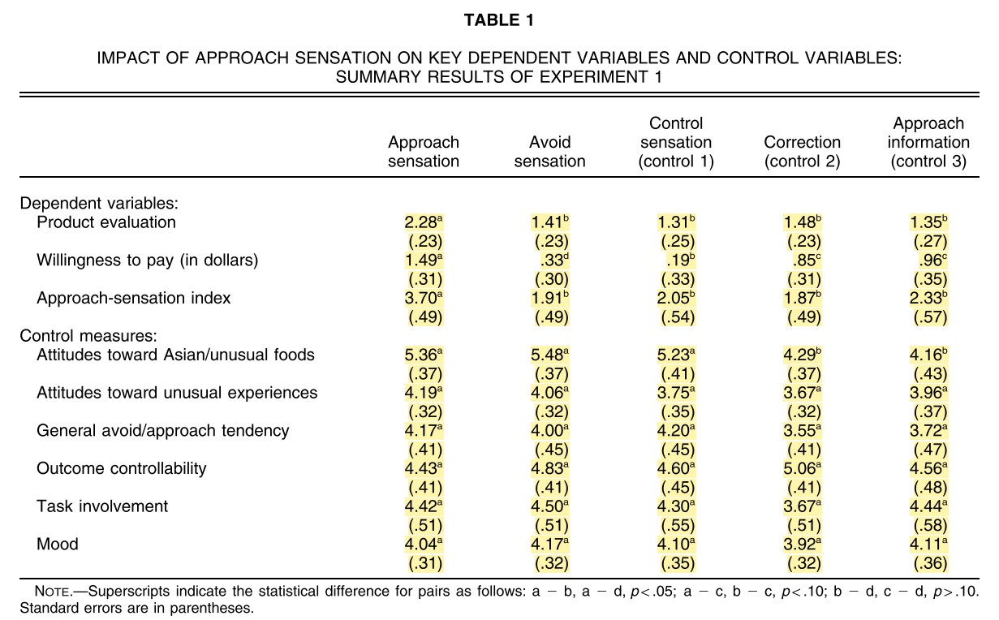

```r
# This function takes in a data frame of characteristics and simulates nreps standard deviations
sd_samp <- function(df, reps) {
  # Number of people in each cell
  nper <- as.numeric(df[1, "n_per"])
  # Minimum score on the scale
  minscore <- as.numeric(df[1, "min_score"])
  # Maximum score on the scale
  maxscore <- as.numeric(df[1, "max_score"])
  # mean observed
  mean <- as.numeric(df[1, "mean"])
  # pooled sd 
  pooledsd <- as.numeric(df[1, "pooled_sd_obs"])
  
  # Simulate SDs
  # NOTE: I'm using a truncated normal distribution because they use a 1-7 scale
  rep_d <- replicate(reps,
                    sd(rtruncnorm(nper, a = minscore, b = maxscore, mean = mean, 
                                  sd = pooledsd))) 
  reps_df <- as.data.frame(rep_d)
  
  names(reps_df) <- "sd_rep"
  
  reps_df
}
```


```r
# Add in the number of participants per cell and the standard deviation to table 1
tbl1 <- tbl1 %>%
  mutate(n_per = 11,
         sd = se * sqrt(n_per)) %>%
  arrange(variable) 

# create sd_sd and mean_sd for each variable in the study
tbl1_sum <- tbl1 %>%
  group_by(variable) %>%
  summarise(sd_sd_obs = sd(sd),
            pooled_sd_obs = mean(sd),
            mean_n_obs = mean(n_per),
            se_sds_obs = pooled_sd_obs/(sqrt(2*mean_n_obs)),
            psi_obs = sd_sd_obs / se_sds_obs)

# merge dataframes (need this for the simulation)
tbl1 <- merge(tbl1, tbl1_sum)
```


```r
reps <- 10000

# simulate SDs
tbl1_reps <- tbl1 %>%
  group_by(variable, manip) %>%
  do(sd_samp(df = ., reps = reps))

# add in the replication number
tbl1_reps <- tbl1_reps %>%
  group_by(variable, manip) %>%
  mutate(n_rep = 1:reps) 

# Summarized simulated data
tbl1_reps_sum <- tbl1_reps %>% 
  group_by(variable, n_rep) %>%
  summarise(sd_sd_sim = sd(sd_rep),
            pooled_sd_sim = mean(sd_rep)) %>%
    # get the simulated standard deviations and psi's
  mutate(se_sd_sim = pooled_sd_sim/(sqrt(2 * 11)),
         psi_sim = sd_sd_sim/se_sd_sim)

# merge simulated data with empirical data
tbl1_reps_sum <- tbl1_reps_sum %>% 
  left_join(tbl1_sum)
```

```
## Joining, by = "variable"
```

```r
# compare the number of observed sds that are larger than the simulated sds
tbl1_reps_sum <- tbl1_reps_sum %>%
  mutate(obs_gt_sim = ifelse(sd_sd_obs >= sd_sd_sim, TRUE, FALSE))
```

# Summary 

Labroo and Nielsen (2010) Experiment 1 "demonstrates a positive effect of embodied movement in space toward an otherwise aversive product."

In table 1 of the paper, the standard devations within measures are quite similar to one another. 



Simonsohn (2013) found that similar standard deviations were unlikely to occur do to chance. 


I follow the analysis strategy of Simonsohn below. 

# SD Similarity 

## Within measures

Density plots of the simulated standard deviations for each of the measures reported in Table 1 of Labroo and Nielsen. 
Vertical Lines represent the observed standard deviation of standard deviations. 
Note that the observed standard deviations are all unlikely


```r
# plot the histograms
ggplot(tbl1_reps_sum, aes(x = sd_sd_sim)) +
  geom_density() +
  geom_vline(aes(xintercept = sd_sd_obs)) +
  facet_grid(variable ~ .) +
  theme_classic()
```

<!-- -->


## Combined measures

Now combining the standard deviations across measures.  
From Simonsohn 2013 pg. 1878

>  Before aggregating, however, I had to get around the problem that the studies differed in scale (e.g., grams of hot sauce vs.
number of fish) and sample size (n = 15 vs. n = 20).
An easy way to do this was to divide the standard
deviation of the standard deviations by the standard error
of the (pooled) standard deviation. This yielded an intuitive measure of deviation the number of standard errors by which the standard deviations differed within a given study. I refer to this number as Ψ

NOTE: Whereas Simonsohn (2013) combined dependent variables across multiple studies, I am combining across multiple measures within a single study.
This should not be an issue unless we believe that there is a correlation between standard deviations. Given that there is no a priori reason why measures would be correlated with one another, I continue assuming they are uncorrelated. 


```r
sim_meanpsi <- tbl1_reps_sum %>%
  group_by(n_rep) %>%
  # get mean psi for each replication
  summarise(mean_psi_sim = mean(psi_sim),
            # changed this
            psi_obs = mean(psi_obs)) %>%
  # get the number of simulated SD's which are larger than the observed
  mutate(simpsi_gt_stupsi = ifelse(mean_psi_sim > psi_obs, TRUE, FALSE))
```

Of the simulated standard deviations, 10000 of the 10^{4} had higher $\psi$ values than the observed $\psi$ value. That is, the combined measure of the variability of standard deviation was higher for every simulation than the observed data. 


Density plot of the simulated $\psi$ values. 
The observed $\psi$ value is denoted by a vertical line. 
Note that the observed $\psi$ is below any of the simulated $\psi$ values. 


```r
sim_meanpsi %>% 
  ggplot(aes(x = mean_psi_sim)) +
  geom_density() +
  geom_vline(aes(xintercept = psi_obs)) +
  theme_classic()
```

<!-- -->


## Looking at just the dvs


```r
dv_sim_meanpsi <- tbl1_reps_sum %>%
  filter(variable %in% c("app_sen_ind", "prod_eval", "wtp")) %>% 
  group_by(n_rep) %>%
  # get mean psi for each replication
  summarise(mean_psi_sim = mean(psi_sim),
            psi_obs = mean(psi_obs)) %>%
  # get the number of simulated SD's which are larger than the observed
  mutate(simpsi_gt_stupsi = ifelse(mean_psi_sim > psi_obs, TRUE, FALSE))
```


# Assuming DVs are correlated 


```r
# load packages
library(mvtnorm)
library(tmvtnorm)
```

```
## Loading required package: Matrix
```

```
## Loading required package: stats4
```

```
## Loading required package: gmm
```

```
## Loading required package: sandwich
```

```r
library(matrixcalc)
library(corpcor)
```

```
## 
## Attaching package: 'corpcor'
```

```
## The following object is masked from 'package:matrixcalc':
## 
##     is.positive.definite
```

```r
library(tidyverse)
```

```
## -- Attaching packages ------------------------------------------------------------------------------- tidyverse 1.2.1 --
```

```
## v tibble  2.1.3     v purrr   0.3.2
## v tidyr   1.0.0     v stringr 1.4.0
## v readr   1.3.1     v forcats 0.4.0
```

```
## -- Conflicts ---------------------------------------------------------------------------------- tidyverse_conflicts() --
## x tidyr::expand() masks Matrix::expand()
## x dplyr::filter() masks stats::filter()
## x dplyr::lag()    masks stats::lag()
## x tidyr::pack()   masks Matrix::pack()
## x tidyr::unpack() masks Matrix::unpack()
```

## Correlated at $r = .9$

This analysis assumes that the dependent variables are highly correlated. 
When the DVs are correlated, their standard deviations should also be correlated across conditions.

Some issues with this:

1. Compared to using a non-truncated multivariate normal distribution (Like your simulation), using a truncated normal distribution leads to smaller correlations between the sd of sd's when the mean's is close to the lower/upper bound. I think this is because many samples hit the bounds. See _Correlation between SD(SD) is smaller when means are close to boundaries_
2. The covariance matrix wasn't positive semidefinite, so I ran a function which made the determinate > 0. 
3. I don't think that WTP is normally distributed (it should be something like a lognormal). 


```r
# just look at the three main dependent variables
tb1_dvs <- tbl1 %>% 
  filter(variable %in% c("prod_eval", "wtp","app_sen_ind"))


# set up correlation and covariance matrix
correlation <- .9
sigma <- diag(1, 3, 3)
sigma[sigma == 0] <- correlation
# make the pooled sd's variances
diag(sigma) <- (c(1.71, 0.8026, 1.061))^2

# make sigma positive definite
# have to add tolerace
# from: https://stackoverflow.com/questions/27176595/error-sigma-must-be-positive-definite
sigma <- make.positive.definite(sigma, tol = 1e-3)
# check that the determinate isn't 0
det(sigma)
```

```
## [1] 0.007507558
```

```r
# Function which calculates SDs of DVs for correlated variables
# INPUT:
## means: observed means (need to be in the following order: app_sen_ind, prod_eval, wtp)
## sigma: covariance matrix (same for every condition based on pooled sd's and equivalent correlations across conditions)

# OUTPUT:
## standard deviations of the three DVs from a sample from a multivariate normal distribution 
sd_cor_fn <- function(means, sigma) {
  
  # Pull from a truncated multivariate normal distribution
  dvs <- rtmvnorm(
    n = 11,
    mean = means,
    sigma = sigma,
    lower = c(1, 1, 0),
    upper = c(7, 7, 10)
  )
  # Calc SDs and make pretty
  sds <- apply(dvs, 2, sd)
  names(sds) <- c("app_sen_ind", "prod_eval", "wtp")
  sds
}


# subset dataframe with only three DVs
tbl1_dvs <- tbl1 %>% 
  filter(variable %in% c("app_sen_ind", "prod_eval", "wtp")) %>% 
  # arrange so consistent with function
  arrange(variable)

# run multiple times
replicates <- tbl1_dvs %>%
  group_by(manip) %>%
  arrange(variable) %>% 
  # 
  group_modify(~ replicate(
    reps, 
    (sd_cor_fn(
      means = .x %>% pull(mean),
      sigma)
    ) 
    )%>% 
      t() %>% 
      as_tibble()
    )

# clean up dataframe
replicates <- replicates %>% 
  group_by(manip) %>% 
  mutate(reps = 1:n())

# create long version of dataframe 
replicates_longer <- replicates %>% 
  pivot_longer(cols = c(app_sen_ind, prod_eval, wtp))
```

### Correlation between standard deviations


```r
reps_cors <- replicates %>% 
  group_by(reps) %>% 
  summarise(sd_sd_app = sd(app_sen_ind),
            sd_sd_prd = sd(prod_eval),
            sd_sd_wtp = sd(wtp))

cor(reps_cors[, -1])
```

```
##            sd_sd_app  sd_sd_prd  sd_sd_wtp
## sd_sd_app 1.00000000 0.09267986 0.04335806
## sd_sd_prd 0.09267986 1.00000000 0.92395774
## sd_sd_wtp 0.04335806 0.92395774 1.00000000
```


Plot of simulated sds compared to observed sds


```r
# create dataframe which looks at each DV
sd_sd_sim <- replicates_longer %>% 
  group_by(name, reps) %>% 
  summarise(sd_sd_sim = sd(value),
            pooled_sd_sim = mean(value)) %>%
    # get the simulated standard deviations and psi's
  mutate(se_sd_sim = pooled_sd_sim/(sqrt(2 * 11)),
         psi_sim = sd_sd_sim/se_sd_sim) %>% 
  rename(variable = name)

# join with observed sd of sds 
sd_sd_sim <- sd_sd_sim %>% 
  left_join(tbl1_sum)
```

```
## Joining, by = "variable"
```

```r
sd_sd_sim_wide <- sd_sd_sim %>% 
  dplyr::select(reps, variable, sd_sd_sim) %>% 
  pivot_wider(id_cols = reps,
              values_from = sd_sd_sim,
              names_from = variable)
  

# density plot
sd_sd_sim %>% 
  ggplot(aes(x = sd_sd_sim)) +
  geom_density() +
  geom_vline(aes(xintercept = sd_sd_obs)) +
  facet_grid(variable~.) +
  theme_classic()
```

<!-- -->

Now calculate $\psi$


```r
sim_meanpsi <- sd_sd_sim %>%
  group_by(reps) %>%
  # get mean psi for each replication
  summarise(mean_psi_sim = mean(psi_sim),
            psi_obs = mean(psi_obs)) %>%
  # get the number of simulated SD's which are larger than the observed
  mutate(simpsi_gt_stupsi = ifelse(mean_psi_sim > psi_obs, TRUE, FALSE))


sim_meanpsi %>% 
  ggplot(aes(x = mean_psi_sim)) +
  geom_density() +
  geom_vline(aes(xintercept = psi_obs)) +
  theme_classic()
```

<!-- -->
Of the simulated standard deviations, 9994 of the 10^{4} had higher $\psi$ values than the observed $\psi$ value.


# Correlation between SD(SD) is smaller when means are close to boundaries

Reminder: Scales were bounded at 1 and 7. WTP was bounded at 0

When in the middle of the range, results are similar to your simulation. 
$r = .9$

$/mu = 3$


```r
r = .9  
Sigma <- diag(1, 3, 3)
Sigma[Sigma == 0] <- r
ncond <- 5
nrep <- 1000


reps <- replicate(ncond*nrep, 
                  sd_cor_fn(rep(4,3), Sigma))
reps_wide <- t(reps) %>% 
  as_tibble() %>% 
  mutate(cond = rep(1:ncond, nrep),
         rep = rep(1:nrep, each = ncond)) %>% 
  group_by(rep) %>% 
  summarise(sd_app_sen_ind = sd(app_sen_ind),
            sd_prod_eval = sd(prod_eval),
            sd_wtp = sd(wtp))

# truncation depresses correlation between SDs when means are close to boundaries
cor(reps_wide[, -1])
```

```
##                sd_app_sen_ind sd_prod_eval    sd_wtp
## sd_app_sen_ind      1.0000000    0.5945832 0.5905283
## sd_prod_eval        0.5945832    1.0000000 0.5832880
## sd_wtp              0.5905283    0.5832880 1.0000000
```

But when they're close to the endpoints they're smaller

$/mu = 1.2$


```r
reps <- replicate(ncond*nrep, 
                  sd_cor_fn(rep(1.2,3), Sigma))
reps_wide <- t(reps) %>% 
  as_tibble() %>% 
  mutate(cond = rep(1:ncond, nrep),
         rep = rep(1:nrep, each = ncond)) %>% 
  group_by(rep) %>% 
  summarise(sd_app_sen_ind = sd(app_sen_ind),
            sd_prod_eval = sd(prod_eval),
            sd_wtp = sd(wtp))

# truncation depresses correlation between SDs when means are close to boundaries
cor(reps_wide[, -1])
```

```
##                sd_app_sen_ind sd_prod_eval    sd_wtp
## sd_app_sen_ind      1.0000000    0.4840854 0.4695883
## sd_prod_eval        0.4840854    1.0000000 0.4075293
## sd_wtp              0.4695883    0.4075293 1.0000000
```


# Further note

This study is on a similar topic to Sanna et al (2011). 
Both Sanna and Nielsen were affiliated with the University of North Carolina. http://u.arizona.edu/~jesper/Vita.pdf
https://sites.google.com/view/lawrencejsanna/employment?authuser=0


Given that the sample size was 55 and there were 5 conditions, there should be 11 people in each group.
Given this we should expect the degrees of freedom for t-tests comparing the two conditions to be 20; however, the reported degrees is 50. 

