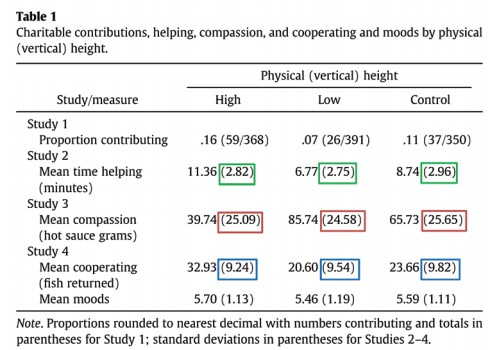

```r
# This function takes in a data frame of characteristics and simulates nreps standard deviations
sd_samp <- function(df, reps) {
  # Number of people in each cell
  nper <- as.numeric(df[1, "n_per"])
  # Minimum score on the scale
  minscore <- as.numeric(df[1, "min_score"])
  # Maximum score on the scale
  maxscore <- as.numeric(df[1, "max_score"])
  # mean observed
  mean <- as.numeric(df[1, "mean"])
  # pooled sd 
  pooledsd <- as.numeric(df[1, "pooled_sd_obs"])
  
  # Simulate SDs
  # NOTE: I'm using a truncated normal distribution because they use a 1-7 scale
  rep_d <- replicate(reps,
                    sd(rtruncnorm(nper, a = minscore, b = maxscore, mean = mean, 
                                  sd = pooledsd))) 
  reps_df <- as.data.frame(rep_d)
  
  names(reps_df) <- "sd_rep"
  
  reps_df
}
```


```r
# Add in the number of participants per cell and the standard deviation to table 1
tbl1 <- tbl1 %>%
  mutate(n_per = 11,
         sd = se * sqrt(n_per)) %>%
  arrange(variable) 

# create sd_sd and mean_sd for each variable in the study
tbl1_sum <- tbl1 %>%
  group_by(variable) %>%
  summarise(sd_sd_obs = sd(sd),
            # Uri calculates pooled sd as 
            pooled_sd_obs = mean(sd),
            mean_n_obs = mean(n_per),
            # standard error of the pooled standard devaition
            # divide pooled standard deviation by the square root of 2 * n per condition (Is this the same for all implementations?)
            # http://urisohn.com/sohn_files/data/JustPostIt/SAS%20Code/(2)%20SAS%20-%20Sanna%20JESP%202011%20-%20bootstrapping.sas
            se_sds_obs = pooled_sd_obs/(sqrt(2*mean_n_obs)),
            psi_obs = sd_sd_obs / se_sds_obs)
```

```
## `summarise()` ungrouping output (override with `.groups` argument)
```

```r
# merge dataframes (need this for the simulation)
tbl1 <- merge(tbl1, tbl1_sum)
```


```r
reps <- 10000

# simulate SDs
tbl1_reps <- tbl1 %>%
  group_by(variable, manip) %>%
  do(sd_samp(df = ., reps = reps))

# add in the replication number
tbl1_reps <- tbl1_reps %>%
  group_by(variable, manip) %>%
  mutate(n_rep = 1:reps) 

# Summarized simulated data
tbl1_reps_sum <- tbl1_reps %>% 
  group_by(variable, n_rep) %>%
  summarise(sd_sd_sim = sd(sd_rep),
            pooled_sd_sim = mean(sd_rep)) %>%
    # get the simulated standard deviations and psi's
  mutate(se_sd_sim = pooled_sd_sim/(sqrt(2 * 11)),
         psi_sim = sd_sd_sim/se_sd_sim)
```

```
## `summarise()` regrouping output by 'variable' (override with `.groups` argument)
```

```r
# merge simulated data with empirical data
tbl1_reps_sum <- tbl1_reps_sum %>% 
  left_join(tbl1_sum)
```

```
## Joining, by = "variable"
```

```r
# compare the number of observed sds that are larger than the simulated sds
tbl1_reps_sum <- tbl1_reps_sum %>%
  mutate(obs_gt_sim = ifelse(sd_sd_obs >= sd_sd_sim, TRUE, FALSE))
```

# Summary 


Labroo and Nielsen (2010) Experiment 1 "demonstrates a positive effect of embodied movement in space toward an otherwise aversive product."

Labroo, A. A., & Nielsen, J. H. (2010). Half the thrill is in the chase: Twisted inferences from embodied cognitions and brand evaluation. Journal of Consumer Research, 37(1), 143-158.

In table 1 of the paper, the standard deviations within measures are quite similar to one another. 


Simonsohn (2013) found that similar standard deviations were unlikely to occur do to chance. 


I follow and adapt the analysis strategy of Simonsohn below. 

# SD Similarity 

## Within measures

Density plots of the simulated standard deviations for each of the measures reported in Table 1 of Labroo and Nielsen. 
Vertical Lines represent the observed standard deviation of standard deviations. 
Note that the observed standard deviations are all unlikely


```r
# plot the histograms
ggplot(tbl1_reps_sum, aes(x = sd_sd_sim)) +
  geom_density() +
  geom_vline(aes(xintercept = sd_sd_obs)) +
  facet_grid(variable ~ .) +
  theme_classic()
```

<!-- -->


## Combined measures

Now combining the standard deviations across measures.  
From Simonsohn 2013 pg. 1878

>  Before aggregating, however, I had to get around the problem that the studies differed in scale (e.g., grams of hot sauce vs.
number of fish) and sample size (n = 15 vs. n = 20).
An easy way to do this was to divide the standard
deviation of the standard deviations by the standard error
of the (pooled) standard deviation. This yielded an intuitive measure of deviation the number of standard errors by which the standard deviations differed within a given study. 
I refer to this number as $\psi$

NOTE: Whereas Simonsohn (2013) combined dependent variables across multiple studies, I am combining across multiple measures within a single study.
This is only an issue for high correlations between standard deviations. I relax the correlation assumption below. 


```r
sim_meanpsi <- tbl1_reps_sum %>%
  group_by(n_rep) %>%
  # get mean psi for each replication
  summarise(mean_psi_sim = mean(psi_sim),
            # changed this
            psi_obs = mean(psi_obs)) %>%
  # get the number of simulated SD's which are larger than the observed
  mutate(simpsi_gt_stupsi = ifelse(mean_psi_sim > psi_obs, TRUE, FALSE))
```

```
## `summarise()` ungrouping output (override with `.groups` argument)
```

Of the simulated standard deviations, 10000 of the 10^{4} had higher $\psi$ values than the observed $\psi$ value. That is, the combined measure of the variability of standard deviation was higher for every simulation than the observed data. 


Density plot of the simulated $\psi$ values. 
The observed $\psi$ value is denoted by a vertical line. 
Note that the observed $\psi$ is below any of the simulated $\psi$ values. 


```r
sim_meanpsi %>% 
  ggplot(aes(x = mean_psi_sim)) +
  geom_density() +
  geom_vline(aes(xintercept = psi_obs)) +
  theme_classic()
```

<!-- -->


# Assuming correlation between variables

## Assuming Dependent Variables Correlated at $r = .9$

This analysis assumes that the dependent variables are highly correlated. 
When the DVs are correlated, their standard deviations should also be correlated across conditions meaning $\psi$ values may also be correlated.


```r
# subset dataframe with only three DVs
tbl1_dvs <- tbl1 %>% 
  filter(variable %in% c("app_sen_ind", "prod_eval", "wtp")) %>% 
  # arrange so consistent with function
  arrange(variable)


# set up correlation matrix
correlation <- .9
cor_mat <- diag(1, 3, 3)
cor_mat[cor_mat == 0] <- correlation

# turn into a covariance matrix
sigma <- cor2cov(cor_mat, c(1.71, 0.8026, 1.061))

# check that the determinate isn't 0
# det(sigma)


# Function which calculates SDs of DVs for correlated variables
# INPUT:
## means: observed means (need to be in the following order: app_sen_ind, prod_eval, wtp)
## sigma: covariance matrix (same for every condition based on pooled sd's and equivalent correlations across conditions)
## lower: lower bound of variable
## upper: upper bound of varialbe
## names: names of the variables
## n: number of participants in that cell

# OUTPUT:
## standard deviations of the three DVs from a sample from a multivariate normal distribution 
sd_cor_fn <- function(means, sigma, lower, upper, names, n) {
  
  # Pull from a truncated multivariate normal distribution
  measures <- rtmvnorm(
    n = n,
    mean = means,
    sigma = sigma,
    lower = lower,
    upper = upper
  )
  # Calc SDs and make pretty
  sds <- apply(measures, 2, sd)
  names(sds) <- names
  sds
}

reps <- 1e4
# run multiple times
dvs_sds <- tbl1_dvs %>%
    group_by(manip) %>%
    arrange(variable) %>%
    #
    group_modify(~ replicate(reps,
                             (
                               sd_cor_fn(
                                 means = .x %>% pull(mean),
                                 sigma,
                                 lower = .x %>%  pull(min_score),
                                 upper = .x %>%   pull(max_score),
                                 names = .x %>%  pull(variable),
                                 n = .x %>%  pull(n_per) %>% `[`(1)
                               )
                             )) %>%
                   t() %>%
                   as_tibble()
                 )


# clean up dataframe
dvs_sds <- dvs_sds %>% 
  group_by(manip) %>% 
  mutate(reps = 1:n())

# create long version of dataframe 
dvs_sds_longer <- dvs_sds %>% 
  pivot_longer(cols = c(app_sen_ind, prod_eval, wtp))
```

### Correlation between standard deviations


```r
reps_cors <- dvs_sds %>% 
  group_by(reps) %>% 
  summarise(sd_sd_app = sd(app_sen_ind),
            sd_sd_prd = sd(prod_eval),
            sd_sd_wtp = sd(wtp))
```

```
## `summarise()` ungrouping output (override with `.groups` argument)
```

```r
cor(reps_cors[, -1])
```

```
##           sd_sd_app sd_sd_prd sd_sd_wtp
## sd_sd_app 1.0000000 0.4500900 0.4229172
## sd_sd_prd 0.4500900 1.0000000 0.4612811
## sd_sd_wtp 0.4229172 0.4612811 1.0000000
```


### Plot of simulated sds compared to observed sds


```r
# create dataframe which looks at each DV
sd_sd_sim <- dvs_sds_longer %>% 
  group_by(name, reps) %>% 
  summarise(sd_sd_sim = sd(value),
            pooled_sd_sim = mean(value)) %>%
    # get the simulated standard deviations and psi's
  mutate(se_sd_sim = pooled_sd_sim/(sqrt(2 * 11)),
         psi_sim = sd_sd_sim/se_sd_sim) %>% 
  rename(variable = name)
```

```
## `summarise()` regrouping output by 'name' (override with `.groups` argument)
```

```r
# join with observed sd of sds 
sd_sd_sim <- sd_sd_sim %>% 
  left_join(tbl1_sum)
```

```
## Joining, by = "variable"
```

```r
sd_sd_sim_wide <- sd_sd_sim %>% 
  dplyr::select(reps, variable, sd_sd_sim) %>% 
  pivot_wider(id_cols = reps,
              values_from = sd_sd_sim,
              names_from = variable)
  

# density plot
sd_sd_sim %>% 
  ggplot(aes(x = sd_sd_sim)) +
  geom_density() +
  geom_vline(aes(xintercept = sd_sd_obs)) +
  facet_grid(variable~.) +
  theme_classic()
```

<!-- -->

Now calculate $\psi$


```r
sim_meanpsi <- sd_sd_sim %>%
  group_by(reps) %>%
  # get mean psi for each replication
  summarise(mean_psi_sim = mean(psi_sim),
            psi_obs = mean(psi_obs)) %>%
  # get the number of simulated SD's which are larger than the observed
  mutate(simpsi_gt_stupsi = ifelse(mean_psi_sim > psi_obs, TRUE, FALSE))
```

```
## `summarise()` ungrouping output (override with `.groups` argument)
```

```r
sim_meanpsi %>% 
  ggplot(aes(x = mean_psi_sim)) +
  geom_density() +
  geom_vline(aes(xintercept = psi_obs)) +
  theme_classic()
```

<!-- -->
Of the simulated standard deviations, 9996 of the 10^{4} had higher $\psi$ values than the observed $\psi$ value.


## Assuming control variables are correlated at .9


```r
tbl1_ctrls <- tbl1 %>% 
  filter(!(variable %in% c("prod_eval", "wtp","app_sen_ind"))) %>% 
  mutate(variable = factor(variable,
                        levels = c("att_asn",
                                   "att_unus",
                                   "gen_app_avo",
                                   "mood",
                                   "out_ctrl",
                                   "task_invol")))


# set up correlation and covariance matrix
correlation <- .9
cor_mat <- diag(1, 6, 6)
cor_mat[cor_mat == 0] <- correlation

# turn into a covariance matrix
sigma <- cor2cov(cor_mat, tbl1_ctrls %>% group_by(variable) %>% summarise(std_dev = pooled_sd_obs[1]) %>% pull(std_dev))
```

```
## `summarise()` ungrouping output (override with `.groups` argument)
```

```r
# check that the determinate isn't 0
det(sigma)
```

```
## [1] 0.001868709
```

```r
# run multiple times
ctrls_sds <- tbl1_ctrls %>%
    group_by(manip) %>%
    arrange(variable) %>%
    #
    group_modify(~ replicate(reps,
                             (
                               sd_cor_fn(
                                 means = .x %>% pull(mean),
                                 sigma,
                                 lower = .x %>%  pull(min_score),
                                 upper = .x %>%   pull(max_score),
                                 names = .x %>%  pull(variable),
                                 n = .x %>%  pull(n_per) %>% `[`(1)
                               )
                             )) %>%
                   t() %>%
                   as_tibble()
                 )
  
# clean up dataframe
ctrls_sds <- ctrls_sds %>% 
  group_by(manip) %>% 
  mutate(reps = 1:n())

# create long version of dataframe
ctrls_sds_longer <- ctrls_sds %>%
  pivot_longer(cols = c(att_asn, att_unus, gen_app_avo, mood, out_ctrl, task_invol))
```


```r
ctrls_sds_cors <- ctrls_sds_longer %>% 
  group_by(reps, name) %>% 
  summarise(sd_sd_val = sd(value)) %>% 
  pivot_wider(names_from= name, values_from = sd_sd_val)
```

```
## `summarise()` regrouping output by 'reps' (override with `.groups` argument)
```

```r
cor(ctrls_sds_cors[, -1])
```

```
##               att_asn  att_unus gen_app_avo      mood  out_ctrl task_invol
## att_asn     1.0000000 0.3734990   0.3567361 0.3875553 0.3755219  0.3649730
## att_unus    0.3734990 1.0000000   0.3803724 0.3745716 0.3753450  0.3635237
## gen_app_avo 0.3567361 0.3803724   1.0000000 0.3682108 0.3665348  0.3535342
## mood        0.3875553 0.3745716   0.3682108 1.0000000 0.3732249  0.3587746
## out_ctrl    0.3755219 0.3753450   0.3665348 0.3732249 1.0000000  0.3741967
## task_invol  0.3649730 0.3635237   0.3535342 0.3587746 0.3741967  1.0000000
```


Plot of simulated sds compared to observed sds


```r
# create dataframe which looks at each DV
sd_sd_sim <- ctrls_sds_longer %>% 
  group_by(name, reps) %>% 
  summarise(sd_sd_sim = sd(value),
            pooled_sd_sim = mean(value)) %>%
    # get the simulated standard deviations and psi's
  mutate(se_sd_sim = pooled_sd_sim/(sqrt(2 * 11)),
         psi_sim = sd_sd_sim/se_sd_sim) %>% 
  rename(variable = name)
```

```
## `summarise()` regrouping output by 'name' (override with `.groups` argument)
```

```r
# join with observed sd of sds 
sd_sd_sim <- sd_sd_sim %>% 
  left_join(tbl1_sum)
```

```
## Joining, by = "variable"
```

```r
sd_sd_sim_wide <- sd_sd_sim %>% 
  dplyr::select(reps, variable, sd_sd_sim) %>% 
  pivot_wider(id_cols = reps,
              values_from = sd_sd_sim,
              names_from = variable)
  

# density plot
sd_sd_sim %>% 
  ggplot(aes(x = sd_sd_sim)) +
  geom_density() +
  geom_vline(aes(xintercept = sd_sd_obs)) +
  facet_grid(variable~.) +
  theme_classic()
```

<!-- -->

Now calculate $\psi$


```r
sim_meanpsi <- sd_sd_sim %>%
  group_by(reps) %>%
  # get mean psi for each replication
  summarise(mean_psi_sim = mean(psi_sim),
            psi_obs = mean(psi_obs)) %>%
  # get the number of simulated SD's which are larger than the observed
  mutate(simpsi_gt_stupsi = ifelse(mean_psi_sim > psi_obs, TRUE, FALSE))
```

```
## `summarise()` ungrouping output (override with `.groups` argument)
```

```r
sim_meanpsi %>% 
  ggplot(aes(x = mean_psi_sim)) +
  geom_density() +
  geom_vline(aes(xintercept = psi_obs)) +
  theme_classic()
```

<!-- -->
Of the simulated standard deviations, 10000 of the 10^{4} had higher $\psi$ values than the observed $\psi$ value.


# Further note

This study is on a similar topic to Sanna et al (2011). 
Both Sanna and Nielsen were affiliated with the University of North Carolina. http://u.arizona.edu/~jesper/Vita.pdf
https://sites.google.com/view/lawrencejsanna/employment?authuser=0


Given that the sample size was 55 and there were 5 conditions, there should be 11 people in each group.
Given this we should expect the degrees of freedom for t-tests comparing the two conditions to be 20; however, the reported degrees is 50. 

# Same author, similar data patterns

## Easier is not always better 

Nielsen was first author on "Easier is not always better: The moderating role of processing type on preference fluency." which also contains highly similar standard deviations. 

Nielsen, J. H., & Escalas, J. E. (2010). Easier is not always better: The moderating role of processing type on preference fluency. Journal of Consumer Psychology, 20(3), 295-305.

### Table 1


```r
nlsn_escls_tbl1 <- read_csv("nielsen-escalas-2010-tbl1.csv")
```

```
## Parsed with column specification:
## cols(
##   dv = col_character(),
##   cond = col_character(),
##   mean = col_double(),
##   se = col_double(),
##   min_score = col_double(),
##   max_score = col_double(),
##   n_per = col_double()
## )
```

```r
nlsn_escls_tbl1 <- nlsn_escls_tbl1 %>% 
  mutate(sd = se * sqrt(n_per))

nlsn_escls_tbl1_sum <- nlsn_escls_tbl1 %>% 
  group_by(dv) %>% 
  summarise(sd_sd_obs = sd(sd),
            pooled_sd_obs = mean(sd),
            mean_n_obs = mean(n_per),
            se_sds_obs = pooled_sd_obs/(sqrt(2*mean_n_obs)),
            psi_obs = sd_sd_obs / se_sds_obs)
```

```
## `summarise()` ungrouping output (override with `.groups` argument)
```

```r
# merge dataframes (need this for the simulation)
nlsn_escls_tbl1 <- merge(nlsn_escls_tbl1, nlsn_escls_tbl1_sum)

# set up correlation and covariance matrix
correlation <- .9
cor_mat <- diag(1, 4, 4)
cor_mat[cor_mat == 0] <- correlation

# turn into a covariance matrix
sigma <- cor2cov(cor_mat, nlsn_escls_tbl1 %>% group_by(dv) %>% summarise(std_dev = pooled_sd_obs[1]) %>% pull(std_dev))
```

```
## `summarise()` ungrouping output (override with `.groups` argument)
```

```r
# check that the determinate isn't 0
det(sigma)
```

```
## [1] 1.225041
```

```r
# run multiple times
nlsn_escls_tbl1_sds <- nlsn_escls_tbl1 %>%
    group_by(cond) %>%
    arrange(dv) %>%
    #
    group_modify(~ replicate(reps,
                             (
                               sd_cor_fn(
                                 means = .x %>% pull(mean),
                                 sigma,
                                 lower = .x %>%  pull(min_score),
                                 upper = .x %>%   pull(max_score),
                                 names = .x %>%  pull(dv),
                                 n = .x %>%  pull(n_per) %>% `[`(1)
                               )
                             )) %>%
                   t() %>%
                   as_tibble()
                 )
  
# clean up dataframe
nlsn_escls_tbl1_sds <- nlsn_escls_tbl1_sds %>% 
  group_by(cond) %>% 
  mutate(reps = 1:n())

# create long version of dataframe
nlsn_escls_tbl1_sds_lng <- nlsn_escls_tbl1_sds %>%
  pivot_longer(cols = -c(cond, reps))
```


```r
nlsn_escls_tbl1_cors <- nlsn_escls_tbl1_sds_lng %>% 
  group_by(reps, name) %>% 
  summarise(sd_sd_val = sd(value)) %>% 
  pivot_wider(names_from= name, values_from = sd_sd_val)
```

```
## `summarise()` regrouping output by 'reps' (override with `.groups` argument)
```

```r
cor(nlsn_escls_tbl1_cors[, -1])
```

```
##           good_bad  oval_opn       try  use_more
## good_bad 1.0000000 0.3726161 0.3407642 0.2908887
## oval_opn 0.3726161 1.0000000 0.3581662 0.3208960
## try      0.3407642 0.3581662 1.0000000 0.3351325
## use_more 0.2908887 0.3208960 0.3351325 1.0000000
```


Plot of simulated sds compared to observed sds


```r
# create dataframe which looks at each DV
sd_sd_sim <- nlsn_escls_tbl1_sds_lng %>% 
  group_by(name, reps) %>% 
  summarise(sd_sd_sim = sd(value),
            pooled_sd_sim = mean(value)) %>%
    # get the simulated standard deviations and psi's
  mutate(se_sd_sim = pooled_sd_sim/(sqrt(2 * nlsn_escls_tbl1$mean_n_obs[1])),
         psi_sim = sd_sd_sim/se_sd_sim) %>% 
  rename(dv = name)
```

```
## `summarise()` regrouping output by 'name' (override with `.groups` argument)
```

```r
# join with observed sd of sds 
sd_sd_sim <- sd_sd_sim %>% 
  left_join(nlsn_escls_tbl1_sum)
```

```
## Joining, by = "dv"
```

```r
sd_sd_sim_wide <- sd_sd_sim %>% 
  dplyr::select(reps, dv, sd_sd_sim) %>% 
  pivot_wider(id_cols = reps,
              values_from = sd_sd_sim,
              names_from = dv)
  

# density plot
sd_sd_sim %>% 
  ggplot(aes(x = sd_sd_sim)) +
  geom_density() +
  geom_vline(aes(xintercept = sd_sd_obs)) +
  facet_grid(dv~.) +
  theme_classic()
```

<!-- -->


Now calculate $\psi$


```r
sim_meanpsi <- sd_sd_sim %>%
  group_by(reps) %>%
  # get mean psi for each replication
  summarise(mean_psi_sim = mean(psi_sim),
            psi_obs = mean(psi_obs)) %>%
  # get the number of simulated SD's which are larger than the observed
  mutate(simpsi_gt_stupsi = ifelse(mean_psi_sim > psi_obs, TRUE, FALSE))
```

```
## `summarise()` ungrouping output (override with `.groups` argument)
```

```r
sim_meanpsi %>% 
  ggplot(aes(x = mean_psi_sim)) +
  geom_density() +
  geom_vline(aes(xintercept = psi_obs)) +
  theme_classic()
```

<!-- -->
Of the simulated standard deviations, 10000 of the 10^{4} had higher $\psi$ values than the observed $\psi$ value.


### Table 2


This only has 1 dv so no need for correlation across experiments


```r
nlsn_escls_tbl2 <- read_csv("nielsen-escalas-2010-tbl2.csv")
```

```
## Parsed with column specification:
## cols(
##   processing_inst = col_character(),
##   font = col_character(),
##   ad_type = col_character(),
##   mean = col_double(),
##   se = col_double(),
##   min_score = col_double(),
##   max_score = col_double(),
##   n_per = col_double()
## )
```

```r
nlsn_escls_tbl2 <- nlsn_escls_tbl2 %>% 
  mutate(sd = se * sqrt(n_per))

nlsn_escls_tbl2_sum <- nlsn_escls_tbl2 %>% 
  summarise(sd_sd_obs = sd(sd),
            pooled_sd_obs = mean(sd),
            mean_n_obs = mean(n_per),
            se_sds_obs = pooled_sd_obs/(sqrt(2*mean_n_obs)),
            psi_obs = sd_sd_obs / se_sds_obs)


nlsn_escls_tbl2 <- nlsn_escls_tbl2 %>% 
  bind_cols(nlsn_escls_tbl2_sum %>% 
  slice(rep(1:n(), each=8)))
            
            
nlsn_escls_tbl2_reps <- nlsn_escls_tbl2 %>%
  group_by(processing_inst, font, ad_type) %>%
  do(sd_samp(df = ., reps = reps))

# add in the replication number
nlsn_escls_tbl2_reps <- nlsn_escls_tbl2_reps %>%
  group_by(processing_inst, font, ad_type) %>%
  mutate(n_rep = 1:reps) 

# Summarized simulated data
nlsn_escls_tbl2_reps_sum <- nlsn_escls_tbl2_reps %>% 
  group_by(n_rep) %>%
  summarise(sd_sd_sim = sd(sd_rep),
            pooled_sd_sim = mean(sd_rep)) %>%
    # get the simulated standard deviations and psi's
  mutate(se_sd_sim = pooled_sd_sim/(sqrt(2 * nlsn_escls_tbl2$mean_n_obs[1])),
         psi_sim = sd_sd_sim/se_sd_sim)
```

```
## `summarise()` ungrouping output (override with `.groups` argument)
```

```r
nlsn_escls_tbl2_reps_sum %>% 
  ggplot(aes(x = psi_sim)) +
  geom_density() +
  geom_vline(aes(xintercept = nlsn_escls_tbl2_sum$psi_obs)) +
  theme_classic()
```

<!-- -->

of the 10^{4} simulations 10000 had phis larger than the observed phi

### Table 3


This only has 1 dv so no need for correlation across dvs


```r
nlsn_escls_shpro_tbl3 <- read_csv("nielsen-escalas-2010-tbl3.csv")
```

```
## Parsed with column specification:
## cols(
##   image = col_character(),
##   font = col_character(),
##   mean = col_double(),
##   se = col_double(),
##   min_score = col_double(),
##   max_score = col_double(),
##   n_per = col_double()
## )
```

```r
nlsn_escls_shpro_tbl3 <- nlsn_escls_shpro_tbl3 %>% 
  mutate(sd = se * sqrt(n_per))

nlsn_escls_shpro_tbl3_sum <- nlsn_escls_shpro_tbl3 %>% 
  summarise(sd_sd_obs = sd(sd),
            pooled_sd_obs = mean(sd),
            mean_n_obs = mean(n_per),
            se_sds_obs = pooled_sd_obs/(sqrt(2*mean_n_obs)),
            psi_obs = sd_sd_obs / se_sds_obs)


nlsn_escls_shpro_tbl3 <- nlsn_escls_shpro_tbl3 %>% 
  bind_cols(nlsn_escls_shpro_tbl3_sum %>% 
  slice(rep(1:n(), each=5)))
            
            
nlsn_escls_shpro_tbl3_reps <- nlsn_escls_shpro_tbl3 %>%
  group_by(image, font) %>%
  do(sd_samp(df = ., reps = reps))

# add in the replication number
nlsn_escls_shpro_tbl3_reps <- nlsn_escls_shpro_tbl3_reps %>%
  group_by(image, font) %>%
  mutate(n_rep = 1:reps) 

# Summarized simulated data
nlsn_escls_shpro_tbl3_reps_sum <- nlsn_escls_shpro_tbl3_reps %>% 
  group_by(n_rep) %>%
  summarise(sd_sd_sim = sd(sd_rep),
            pooled_sd_sim = mean(sd_rep)) %>%
    # get the simulated standard deviations and psi's
  mutate(se_sd_sim = pooled_sd_sim/(sqrt(2 * nlsn_escls_shpro_tbl3$mean_n_obs[1])),
         psi_sim = sd_sd_sim/se_sd_sim)
```

```
## `summarise()` ungrouping output (override with `.groups` argument)
```

```r
# (nlsn_escls_shpro_tbl3_reps_sum$psi_sim > nlsn_escls_shpro_tbl3_sum$psi_obs) %>% sum


nlsn_escls_shpro_tbl3_reps_sum %>% 
  ggplot(aes(x = psi_sim)) +
  geom_density() +
  geom_vline(aes(xintercept = nlsn_escls_shpro_tbl3_sum$psi_obs)) +
  theme_classic()
```

<!-- -->
of the 10^{4} simulated 7072 were higher than the observed phi

## Automatic Suppression

Nielsen was first author on "Coping with fear appeals through spreading automatic suppression." which also contains highly similar standard deviations. 

Nielsen, J. H., & Shapiro, S. (2009). Coping with fear appeals through spreading automatic suppression. Journal of Experimental Psychology. Applied, 15, 258-274.

### Table 1


```r
nlsn_shpro_tbl1 <- read_csv("nielsen-shapiro-2009-tbl1-totals.csv")
```

```
## Parsed with column specification:
## cols(
##   threat_rel = col_character(),
##   fear_lvl = col_character(),
##   mean = col_double(),
##   sd = col_double(),
##   min_score = col_double(),
##   max_score = col_double(),
##   n_per = col_double()
## )
```

```r
nlsn_shpro_tbl1_sum <- nlsn_shpro_tbl1 %>% 
  summarise(sd_sd_obs = sd(sd),
            pooled_sd_obs = mean(sd),
            mean_n_obs = mean(n_per),
            se_sds_obs = pooled_sd_obs/(sqrt(2*mean_n_obs)),
            psi_obs = sd_sd_obs / se_sds_obs)


nlsn_shpro_tbl1 <- nlsn_shpro_tbl1%>% 
  mutate (sd_sd_obs = sd(sd),
            pooled_sd_obs = mean(sd),
            mean_n_obs = mean(n_per),
            se_sds_obs = pooled_sd_obs/(sqrt(2*mean_n_obs)),
            psi_obs = sd_sd_obs / se_sds_obs)

nlsn_shpro_tbl1_reps <- nlsn_shpro_tbl1 %>%
  group_by(fear_lvl, threat_rel) %>%
  do(sd_samp(df = ., reps = reps))

# add in the replication number
nlsn_shpro_tbl1_reps <- nlsn_shpro_tbl1_reps %>%
  group_by(fear_lvl, threat_rel) %>%
  mutate(n_rep = 1:reps) 

# Summarized simulated data
nlsn_shpro_tbl1_reps_sum <- nlsn_shpro_tbl1_reps %>% 
  group_by(fear_lvl, n_rep) %>%
  summarise(sd_sd_sim = sd(sd_rep),
            pooled_sd_sim = mean(sd_rep)) %>%
    # get the simulated standard deviations and psi's
  mutate(se_sd_sim = pooled_sd_sim/(sqrt(2 * nlsn_shpro_tbl1$mean_n_obs[1])),
         psi_sim = sd_sd_sim/se_sd_sim)
```

```
## `summarise()` regrouping output by 'fear_lvl' (override with `.groups` argument)
```

```r
nlsn_shpro_tbl1_reps_sum %>% 
  ggplot(aes(x = psi_sim)) +
  geom_density() +
  geom_vline(aes(xintercept = nlsn_shpro_tbl1_sum$psi_obs)) +
  theme_classic()
```

<!-- -->

of the 10^{4} simulations 9846 were higher than the observed psi


# Conclusions
Three papers with Jesper Nielsen as an author report variables with highly similar standard deviations across conditions. 
The level of similarity is unlikely to be due to chance alone.
I believe these issues warrant further investigation. 
